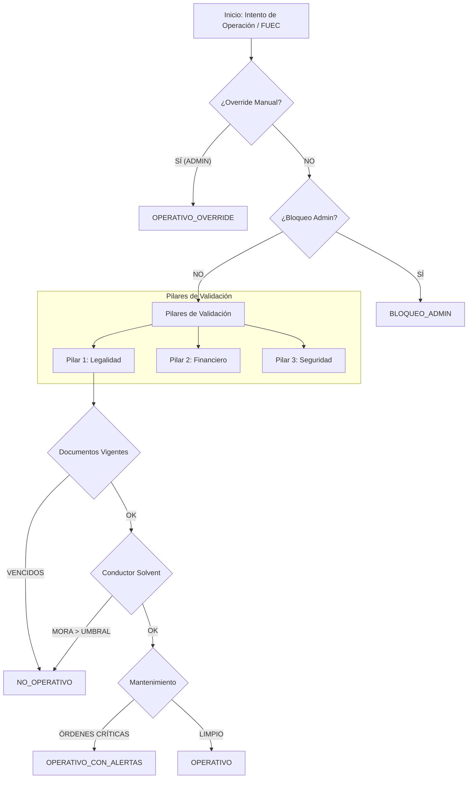

# Esquema de Validación de Operatividad (V3)

Este documento detalla el flujo técnico y lógico que el sistema ejecuta para determinar si un vehículo está habilitado para operar y generar planillas FUEC.

## 1. Arquitectura de Decisión

El proceso es gestionado por el `VehicleOperabilityEvaluatorService`, el cual evalúa una serie de reglas jerárquicas:

## 2. Elementos que Interactúan

| Elemento | Responsabilidad | Origen de Datos |
| :--- | :--- | :--- |
| **Documentos Legales** | Valida vigencia de SOAT, Tecnomecánica, Tarjeta de Operación y Pólizas. | `DocumentoVehiculo` |
| **Kill-Switch Financiero** | Verifica si el conductor asignado tiene deudas mayores al umbral (p.ej. $200k). | `ObligacionFinanciera` |
| **Mantenimiento** | Revisa órdenes de servicio `PENDIENTES`. No bloquea pero genera alerta naranja. | `OrdenServicio` |
| **Checklist Operativo** | Declaración jurada del conductor al momento de emitir la planilla. | `FuecSafetyChecklist` |

## 3. Estados Resultantes

1.  **OPERATIVO (Verde):** Cumple todos los requisitos.
2.  **OPERATIVO CON ALERTAS (Naranja):** Documentos por vencer (<30 días) u órdenes de servicio pendientes.
3.  **NO OPERATIVO (Rojo):** Documentos vencidos o conductor bloqueado por mora.
4.  **BLOQUEADO ADMIN:** Bloqueo manual por el centro de control.
5.  **OPERATIVO OVERRIDE:** Desbloqueo forzado por un administrador (ignora restricciones).

## 4. Proceso de Generación FUEC

Al generar un FUEC, el sistema realiza este "Triple Check":
1.  **Estado Legal:** Verifica `EstadoOperativo !== NO_OPERATIVO`.
2.  **Estado de Seguridad:** El conductor marca el checklist técnico (opcional pero registrado).
3.  **Estado Financiero:** La lógica de `DebtService` valida la capacidad de pago antes de autorizar el ingreso contable.

> [!IMPORTANT]
> A petición del usuario, se ha eliminado la restricción de **Preoperacional Diario Obligatorio** para permitir la emisión ágil de planillas, manteniendo sin embargo la verificación de documentos legales como barrera infranqueable.
